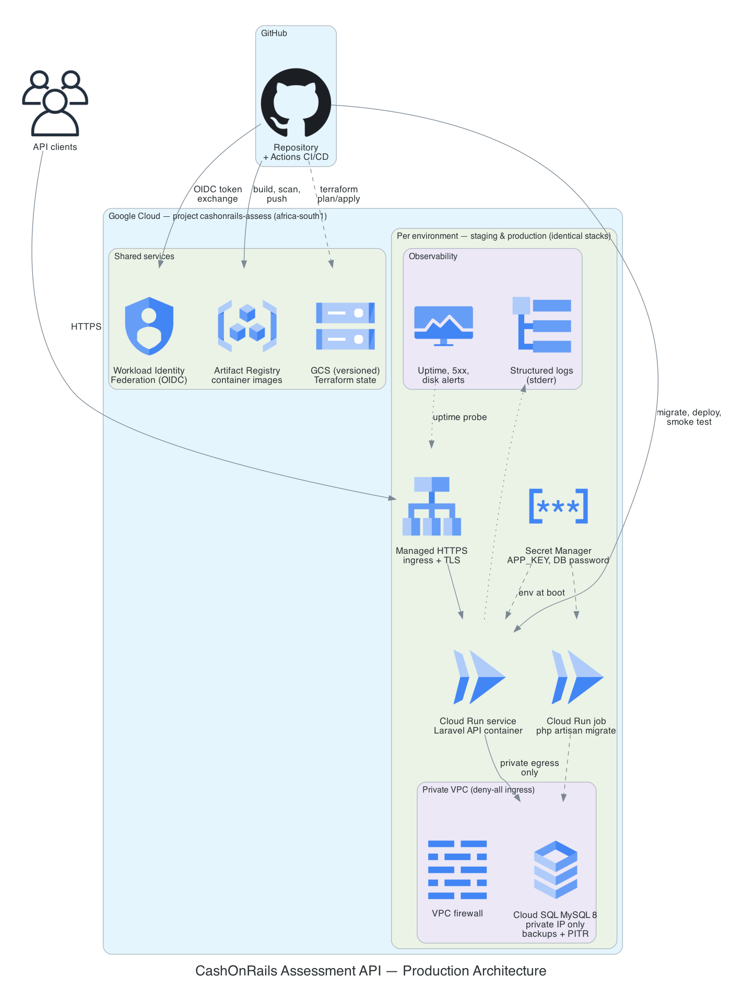
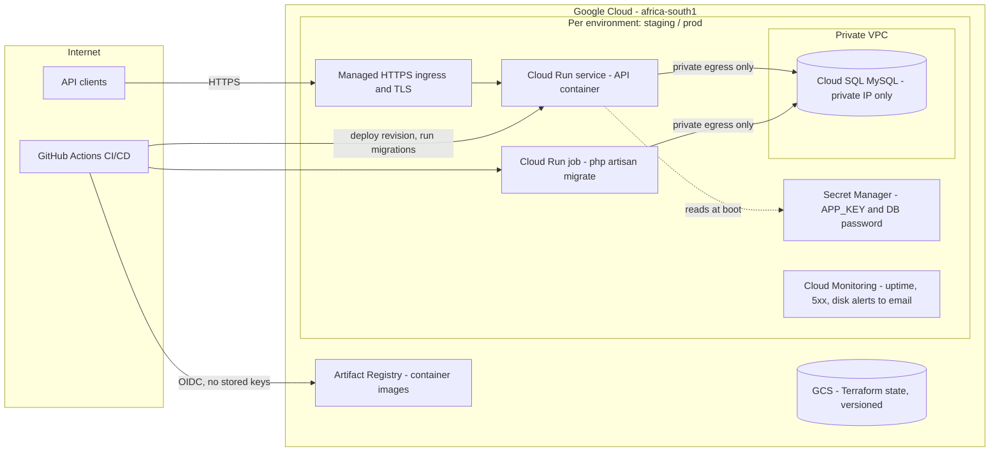

# Architecture

## Summary

The API runs as a container on a serverless container platform (Cloud Run),
fronted by the platform's managed HTTPS load balancer, with persistence on a
managed MySQL instance (Cloud SQL) that is reachable only over private
networking. Terraform provisions everything; GitHub Actions builds, scans,
and rolls out images. Staging and production are fully separate stacks that
share only the container registry and the CI/CD identity.

> **Cloud platform note.** The assessment brief targets Huawei Cloud. This
> implementation was built and verified on Google Cloud within the timebox
> (an active, billing-enabled account was available there), deliberately
> using only primitives with direct Huawei Cloud equivalents. The design,
> module boundaries, pipeline, and controls port one-to-one; the mapping is
> below and the trade-off is documented in the README.

## Diagram

*Generated as diagram-as-code from [`diagram.py`](diagram.py) — regenerate
with `python docs/architecture/diagram.py` (requires `pip install diagrams`
and graphviz).*

The same topology as a text diagram:

## Component choices and trade-offs

### Compute: serverless containers (Cloud Run) over Kubernetes or VMs

| Option | Why not / why |
| --- | --- |
| VMs + docker compose | Cheapest to reason about, but manual capacity, patching, no revision-based rollback, weak platform story. |
| Kubernetes (GKE / Huawei CCE) | Right answer at multi-team scale; overhead not justified for one stateless container within a 72h timebox. The Terraform boundaries here (network / database / service modules) survive a later move to k8s intact. |
| **Serverless containers (chosen)** | Managed TLS + load balancing, revision-based deploys with instant traffic rollback, scale-to-zero in staging, per-revision health gating, no nodes to patch. The app is a stateless container — an exact fit. |

The container needed **zero code changes** to run here: it already listens on
8080, logs to stderr, and exposes health/readiness endpoints. The only
application change in this fork is adding `pdo_mysql` to the Docker image
(one line in the Dockerfile) so Laravel can talk to MySQL.

### Persistence: replacing SQLite

SQLite is retained for local development and CI (fast, zero infrastructure),
but replaced in deployed environments, because for a payments workload it
fails on four production axes:

1. **Concurrency** — single-writer file locking collapses under parallel
   request load.
2. **Durability/HA** — the database lives on one instance's disk; the
   platform's autoscaling would give each instance its *own diverging copy*.
3. **Backup/PITR** — no managed backups, no point-in-time recovery.
4. **Compliance** — no at-rest encryption management, auditing, or residency
   controls.

Managed MySQL 8 (Cloud SQL) provides automated daily backups + binary-log
point-in-time recovery, private-IP-only networking, at-rest encryption, and
an HA flag (`availability_type = REGIONAL`) that is a one-variable change.
Laravel supports MySQL natively, so the swap is pure configuration:
`DB_CONNECTION=mysql` plus credentials injected from Secret Manager.

Cache, sessions, and queue remain **database-backed** (the app's default).
At assessment scale this avoids a Redis dependency entirely; the moment
queue volume or cache pressure justifies it, a managed Redis
(Memorystore / Huawei DCS) drops in via env vars only.

### Networking

- Custom VPC per environment, no default network, no overlapping CIDRs
  (staging `10.60.0.0/24`, prod `10.70.0.0/24`).
- Database has **no public IP**; it is reachable only via private services
  access peering from inside the VPC.
- The service container reaches the VPC through direct VPC egress with
  `PRIVATE_RANGES_ONLY` — internet egress from the app does not transit the
  VPC, and only private traffic enters it.
- An explicit deny-all-ingress firewall rule keeps the VPC closed by
  default.
- Public ingress exists solely at the managed HTTPS front end of the
  service. TLS is terminated there with platform-managed certificates.

### Secrets

- `APP_KEY` and the database password are **generated inside Terraform**
  (`random_bytes` / `random_password`) and stored in Secret Manager with
  regional replication pinned to `africa-south1`. They never appear in
  source control, tfvars, CI variables, or logs.
- The runtime service account is granted `secretAccessor` on exactly its two
  secrets — not project-wide.
- Known trade-off (documented, standard): generated secrets exist in
  Terraform state. State lives in a versioned, access-controlled bucket.
  At larger scale I would move generation out-of-band or use ephemeral
  resources/write-only attributes so state never holds the plaintext.

### Identity model

Three identities, least privilege each:

| Identity | Used by | Can |
| --- | --- | --- |
| `cor-<env>-run` runtime SA | The service + migrate job | Read its two secrets; nothing else |
| `github-deployer` SA | GitHub Actions via OIDC federation | Push images, deploy revisions, execute the migrate job, read-only project view for `terraform plan` |
| Operator (human) | `terraform apply` | Full project — bootstrap and reviewed applies only |

There are **no service account keys anywhere** — CI authenticates with
short-lived OIDC token exchange restricted to this repository
(`attribute_condition` on the workload identity pool provider).

### Scalability and availability

- Horizontal scaling is native: request-based autoscaling from
  `min_instances` (0 staging / 1 prod, avoiding cold starts) to
  `max_instances`. The app is stateless (sessions in DB), so instances are
  interchangeable.
- The database is the vertical-scaling axis: tier is a variable; HA
  failover is `availability_type = REGIONAL`; read replicas are the next
  step after that.
- Each revision must pass its startup probe (`/api/v1/ready`, which checks
  DB connectivity) before receiving traffic; the liveness probe
  (`/api/v1/health`) restarts wedged containers.

## Huawei Cloud service mapping

| Function | Used here (GCP) | Huawei Cloud equivalent |
| --- | --- | --- |
| Container runtime | Cloud Run | CCI (serverless containers) or CCE + light ingress |
| Container registry | Artifact Registry | SWR |
| Managed MySQL | Cloud SQL for MySQL | RDS for MySQL |
| Private DB networking | VPC + private services access | VPC + RDS private access |
| Load balancing / TLS | Cloud Run managed ingress | ELB + SSL certificates |
| Secrets | Secret Manager | CSMS (DEW) |
| Object storage / TF state | GCS (versioned bucket) | OBS (versioned bucket) |
| Metrics + alerting | Cloud Monitoring | Cloud Eye + SMN |
| Logs | Cloud Logging | LTS |
| CI federation | Workload identity federation (OIDC) | IAM identity provider (OIDC) or agency + scoped AK/SK in CI secrets |
| African region | africa-south1 (Johannesburg) | AF-Johannesburg |

The Terraform module boundaries (network / database / service /
observability / stack) are provider-shaped, not provider-specific: porting
means re-expressing each module against the `huaweicloud` provider, not
redesigning the system.

## Cost drivers

Assessment-scale spend is close to zero by design: scale-to-zero staging,
smallest shared-core DB tier, minimal disks. At real scale, cost ranks:

1. **Database** — tier, HA doubling, storage growth, backups. Biggest
   lever; right-size tier and prune backup retention to the RPO actually
   required.
2. **Compute** — min-instance floor × instance size; request volume.
   Scale-to-zero for non-prod environments.
3. **Egress + logging volume** — log-based costs creep; keep structured
   logs, sample debug noise.

Trade-offs I would revisit at larger scale: dedicated-core HA database,
CDN/WAF in front of public ingress, moving queue/cache to Redis, and
splitting billing per environment via separate projects.
